![ArchUnitNET][archunit-logo]
[archunit-logo]: img/ArchUnitNET-Logo.svg

# User Guide

## 1. Installation
To use ArchUnitNET, install the ArchUnitNET package from [NuGet](https://www.nuget.org/packages/TngTech.ArchUnitNET/):
```posh
PS> Install-Package TngTech.ArchUnitNET
```
If you want to use MSTestv2, xUnit or NUnit for your unit tests, you should instead install the corresponding ArchUnit extension:
```posh
PS> Install-Package TngTech.ArchUnitNET.MSTestV2
PS> Install-Package TngTech.ArchUnitNET.xUnit
PS> Install-Package TngTech.ArchUnitNET.NUnit
```
## 2. Quick Start

Create a test class to start testing. We used xUnit with the ArchUnit extension here, but it works similarly with NUnit or other Unit Test Frameworks.

Find this example code [here](https://github.com/TNG/ArchUnitNET/blob/master/ExampleTest/ExampleArchUnitTest.cs).
#### 2.1. Directives
```cs
using ArchUnitNET.Domain;
using ArchUnitNET.Loader;
using ArchUnitNET.Fluent;
using Xunit;

// Add a using directive to ArchUnitNET.Fluent.ArchRuleDefinition to easily define ArchRules
using static ArchUnitNET.Fluent.ArchRuleDefinition;
```

#### 2.2. Load Architecture
Load your architecture once at the start to maximize performance of your tests
replace <ExampleClass\> and <ForbiddenClass\> with classes from the assemblies you want to test
```cs
private static readonly Architecture Architecture =
    new ArchLoader().LoadAssemblies(
        System.Reflection.Assembly.Load("ExampleClassAssemblyName"),
        System.Reflection.Assembly.Load("ForbiddenClassAssemblyName")
    ).Build();
```
#### 2.3. Declare Layers
Declare variables you'll use throughout your tests up here
```cs
// Use As() to give your variables a custom description
private readonly IObjectProvider<IType> ExampleLayer =
    Types().That().ResideInAssembly("ExampleAssembly").As("Example Layer");

private readonly IObjectProvider<Class> ExampleClasses =
    Classes().That().ImplementInterface("IExampleInterface").As("Example Classes");

private readonly IObjectProvider<IType> ForbiddenLayer =
    Types().That().ResideInNamespace("ForbiddenNamespace").As("Forbidden Layer");

private readonly IObjectProvider<Interface> ForbiddenInterfaces =
    Interfaces().That().HaveFullNameContaining("forbidden").As("Forbidden Interfaces");

```
#### 2.4. Test Cases

Testing if above defined "ExampleClasses" reside in "ExampleLayer"
```cs
[Fact]
public void TypesShouldBeInCorrectLayer()
{
    IArchRule exampleClassesShouldBeInExampleLayer =
        Classes().That().Are(ExampleClasses).Should().Be(ExampleLayer);
    IArchRule forbiddenInterfacesShouldBeInForbiddenLayer =
        Interfaces().That().Are(ForbiddenInterfaces).Should().Be(ForbiddenLayer);

    // Check if your architecture fulfills your rules
    exampleClassesShouldBeInExampleLayer.Check(Architecture);
    forbiddenInterfacesShouldBeInForbiddenLayer.Check(Architecture);

    // You can also combine your rules
    IArchRule combinedArchRule =
        exampleClassesShouldBeInExampleLayer
		.And(forbiddenInterfacesShouldBeInForbiddenLayer);
			
    combinedArchRule.Check(Architecture);
}
```
Testing if the types in "ExampleLayer" depend on any object in "ForbiddenLayer"
```cs
[Fact]
public void ExampleLayerShouldNotAccessForbiddenLayer()
{
    // You can give your rules a custom reason, which is displayed when it fails
    // (together with the types that failed the rule)
    IArchRule exampleLayerShouldNotAccessForbiddenLayer = Types().That()
		.Are(ExampleLayer).Should().NotDependOnAny(ForbiddenLayer)
		.Because("it's forbidden");
    exampleLayerShouldNotAccessForbiddenLayer.Check(Architecture);
}
```
Testing naming of classes implementing "ForbiddenInterfaces"
```cs
[Fact]
public void ForbiddenClassesShouldHaveCorrectName()
{
    Classes().That().AreAssignableTo(ForbiddenInterfaces)
        .Should().HaveNameContaining("forbidden").Check(Architecture);
}
```
Testing if "ExampleClasses" call any method declared in "ForbiddenLayer" or with name containing "forbidden"
```cs
[Fact]
public void ExampleClassesShouldNotCallForbiddenMethods()
{
    Classes().That().Are(ExampleClasses).Should()
		.NotCallAny(MethodMembers().That()
		.AreDeclaredIn(ForbiddenLayer).Or().HaveNameContaining("forbidden"))
        .Check(Architecture);
}
```
## 3. What to Check
The following section illustrates some typical checks you could do with ArchUnitNET.

Find this example code [here](https://github.com/TNG/ArchUnitNET/tree/master/ExampleTest).

### 3.1. Namespace Dependency Rule
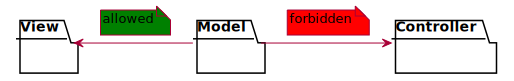
```cs
IArchRule rule = Types().That().ResideInNamespace("Model").Should()
                    .NotDependOnAny(Types().That().ResideInNamespace("Controller"));
```
### 3.2. Class Dependency Rule
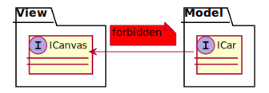
```cs
IArchRule rule = Classes().That().AreAssignableTo(typeof(ICar)).Should()
                    .NotDependOnAny(Classes().That().AreAssignableTo(typeof(ICanvas)));
```
### 3.3. Inheritance Naming Rule
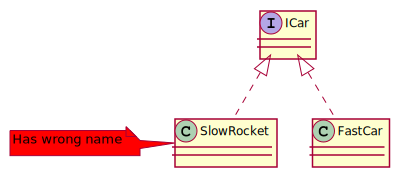
```cs
IArchRule rule = Classes().That().AreAssignableTo(typeof(ICar)).Should()
                    .HaveNameContaining("Car");
```
### 3.4. Class Namespace Containment Rule
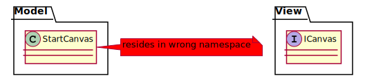
```cs
IArchRule rule = Classes().That().HaveNameContaining("Canvas").Should()
                     .ResideInNamespace(typeof(ICanvas).Namespace);
```
### 3.5. Attribute Access Rule
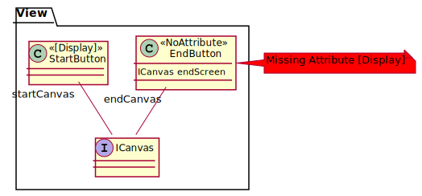
```cs
IArchRule rule = Classes().That().DoNotHaveAnyAttributes(typeof(Display)).Should()
                    .NotDependOnAny(Classes().That().AreAssignableTo(typeof(ICanvas)));
```

### 3.6. Cycle Rule
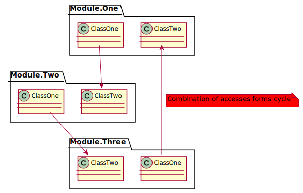
```cs
IArchRule rule = Slices().Matching("Module.(*)").Should()
                    .BeFreeOfCycles();
```

## 4. How to check

To get a meaningful error message we recommend using 
the xUnit or NUnit extension.

### 4.1 ArchUnitNET xUnit/NUnit extension

```cs
IArchRule someRule = ...;
someRule.check(Architecture);
```

### 4.2 ArchUnitNET no extension
```cs
IArchRule someRule = ...;
bool checkedRule = someRule.HasNoViolations(Architecture);
Assert.True(checkedRule);
```
### 4.3 PlantUML Component Diagrams as rules
ArchUnitNET can derive dependency rules from PlantUML diagrams. The rule can be created in the following way:
```cs
String myDiagram = "./Resources/my-diagram.puml";
IArchRule someRule = Types().Should().AdhereToPlantUmlDiagram(myDiagram);
someRule.Check(Architecture);
```
The diagrams must be component diagrams and associate types to components via stereotypes. 
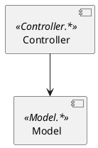
Consider this diagram applied as a rule via AdhereToPlantUmlDiagram(..), then a class that resides in the namespace Model accessing a class in the namepace Controller would be reported as a violation.

Only dependencies specified in the PlantUML diagram are considered. So any unknown dependency (e.g.  View.*) will be ignored.
#### 4.3.1 PlantUML Diagram rules

The rules that a PlantUML diagram used with ArchUnitNet must abide can be found in the [ArchUnit documentation](https://www.archunit.org/userguide/html/000_Index.html#_configurations_2). In contrast to ArchUnit ArchUnitNet uses a regex as the namespace identifier instead of the two dots syntax.

## 5. PlantUML file diagram builder
ArchUnitNET can build a dependency diagram from packages on its own. You can see some examples below.

### 5.1 Full diagram dependencies
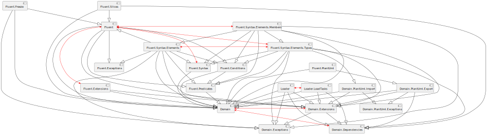
```cs
string pattern = "ArchUnitNET.(**)";
GivenSlices sliceRule = SliceRuleDefinition.Slices().Matching(pattern);
//Replace ArchUnitNET.Domain.Architecture with any class from your pattern
Architecture arch = new ArchLoader().LoadAssembly(typeof(ArchUnitNET.Domain.Architecture).Assembly).Build();

string path = "diagram.puml";

PlantUmlDefinition.ComponentDiagram().WithDependenciesFromSlices(sliceRule.GetObjects(arch)).WriteToFile(path);
```

### 5.2 Structured diagram dependencies
On the previous case there are too many dependencies, this option is suitable mainly for small projects / architectures / slices. With an increase in the number of objects, it makes sense to introduce another type of display - a display with packages. It differs from the previous case only with the modified creation of SliceRule.

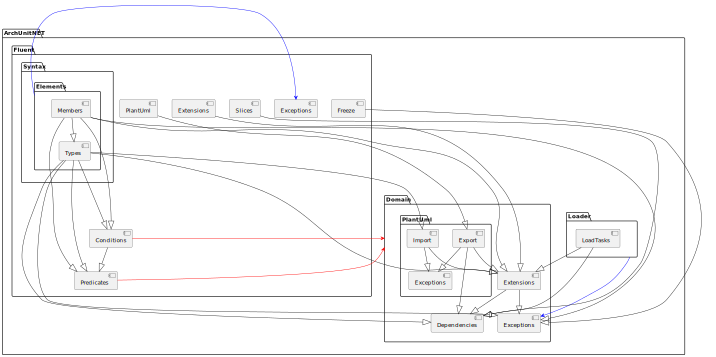
```cs
string pattern = "ArchUnitNET.(**)";
GivenSlices sliceRule = SliceRuleDefinition.Slices().MatchingWithPackages(pattern);
Architecture arch = new ArchLoader().LoadAssembly(typeof(ArchUnitNET.Domain.Architecture).Assembly).Build();

string path = "diagram.puml";

PlantUmlDefinition.ComponentDiagram().WithDependenciesFromSlices(sliceRule.GetObjects(arch)).WriteToFile(path);
```

### 5.3 Compact version
The previous case still shows a large number of connections. For maximum simplification, as well as demonstrating the overall picture, it makes sense to reformat it into a compact version. This kind of display shows dependencies between packages at the same slice level.

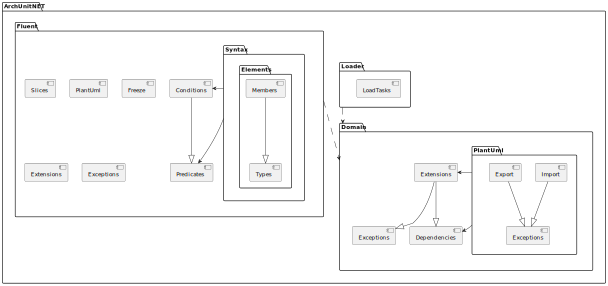
```cs
string pattern = "ArchUnitNET.(**)";
GivenSlices sliceRule = SliceRuleDefinition.Slices().MatchingWithPackages(pattern);
Architecture arch = new ArchLoader().LoadAssembly(typeof(ArchUnitNET.Domain.Architecture).Assembly).Build();
GenerationOptions g = new GenerationOptions(){CompactVersion = true};

string path = "diagram.puml";

PlantUmlDefinition.ComponentDiagram().WithDependenciesFromSlices(sliceRule.GetObjects(arch), g).WriteToFile(path);
```

### 5.4 Small slices
In order not to display all slices and all occurrences, you can use a single asterisk in the pattern. One star is one slice deep. You cannot mix single (*) and double (**) asterisks in a pattern.

#### 5.4.1 ArchUnitNET.(\*)
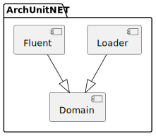
```cs
    string pattern = "ArchUnitNET.(*)";
    ...
```

#### 5.4.2 ArchUnitNET.(\*).(\*)
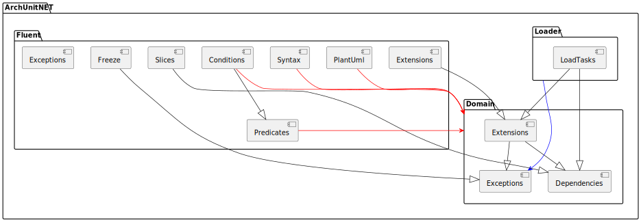
```cs
    string pattern = "ArchUnitNET.(*).(*)";
    ...
```

#### 5.4.3 ArchUnitNET.Fluent.(\*).(\*).(\*)
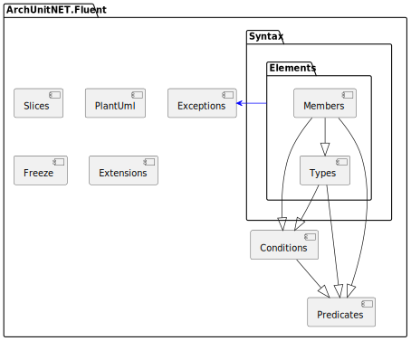
```cs
    string pattern = "ArchUnitNET.Fluent.(*).(*).(*)";
    ...
```

### 5.5 AlternativeView-mod

To enable an alternative view of diagrams, set in the GenerationOptions flag AlternativeView = true.

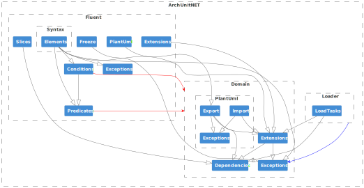
```cs
string pattern = "ArchUnitNET.(*).(*).(*)";
GivenSlices sliceRule = SliceRuleDefinition.Slices().MatchingWithPackages(pattern);
Architecture arch = new ArchLoader().LoadAssembly(typeof(ArchUnitNET.Domain.Architecture).Assembly).Build();
GenerationOptions g = new GenerationOptions(){AlternativeView = true};

string path = "diagram.puml";

PlantUmlDefinition.ComponentDiagram().WithDependenciesFromSlices(sliceRule.GetObjects(arch), g).WriteToFile(path);
```

### 5.6 Focus-mod
Focus mod allows you to show all dependencies on the selected package or out of the package.

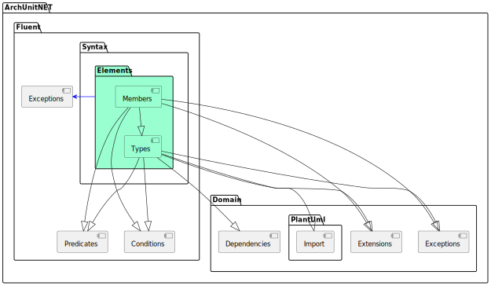
```cs
string pattern = "ArchUnitNET.(**)";
string focusOnThisPackage = "ArchUnitNET.Fluent.Syntax.Elements"
GivenSlices sliceRule = SliceRuleDefinition.Slices().MatchingWithPackages(pattern);
Architecture arch = new ArchLoader().LoadAssembly(typeof(ArchUnitNET.Domain.Architecture).Assembly).Build();

string path = "diagram.puml";

PlantUmlDefinition.ComponentDiagram().WithDependenciesFromSlices(sliceRule.GetObjects(arch), focusOnThisPackage).WriteToFile(path);
```

## 6. Further Reading and Examples
A complete overview of all available methods can be found [here](additional.md).

Check out example code on [Github](https://github.com/TNG/ArchUnitNET/tree/master/ExampleTest "ExampleTests").
